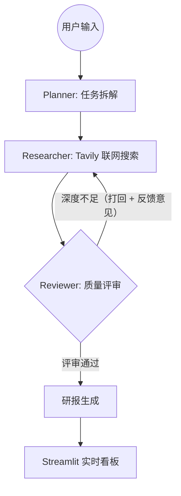

# 🚀 LangGraph Enterprise Deep Research Agent

**基于多智能体协作的生产级行业洞察决策系统**


[](https://github.com/newone-aka-willbestar/LangGraph-Enterprise-Data-Insight-Agent/actions/workflows/tests.yml)
[](LICENSE)

## 📌 项目定位

本项目旨在解决单体 Agent 在处理复杂、长链路调研任务时易出现的指令漂移、逻辑断层及事实幻觉问题。通过 **LangGraph 状态机**构建了一套 **Planner → Researcher → Reviewer** 协作架构，模拟人类专家团队的"规划-调研-评审-产出"工作流，并配套了异步任务调度、Redis 持久化、限流认证、结构化日志等生产级工程能力。

## 🏗️ 架构图解



```
浏览器 ──► Streamlit (app.py)
              │  POST /research        → 立即返回 job_id（<100ms）
              │  GET  /research/{id}   → 每 2s 轮询实时阶段
              ▼
          FastAPI (backend/main.py) ◄──► Redis（任务状态 / Token 统计）
              │  asyncio 后台任务 + astream 逐节点推送进度
              ▼
          LangGraph (graph.py)
              ├─ planner_node    → DeepSeek-V3（tenacity 重试 + 90s 超时）
              ├─ researcher_node → Tavily 搜索 + DeepSeek-V3
              └─ reviewer_node   → DeepSeek-V3（条件路由：打回 / 通过）
```

## 🌟 核心亮点

### Agent 编排层

- **闭环反思架构（Self-Correction Loop）**：通过 LangGraph Conditional Edges 实现 Reviewer 节点对调研素材的质量校验。若深度不足，自动触发"打回机制"并注入反馈意见，引导 Researcher 换方向重新检索；`steps >= 6` 作为兜底安全阀，防止无限迭代消耗 Token。
- **状态原子化管理（Atomic State）**：利用 `StateGraph` 与 `operator.add` 实现状态的非破坏性增量更新，多轮搜索素材自动合并，保证长文生成的上下文连贯性。
- **调研方向轮换**：Researcher 按迭代轮次轮换使用 Planner 拆解出的多个调研方向，避免重复检索同一角度。
- **模型适配**：全线适配国产 DeepSeek-V3 模型，在保证逻辑推理强度的同时大幅降低推理成本。

### 工程化层

- **异步任务模式**：`POST /research` 立即返回 `job_id`，后台 `asyncio` 任务通过 `astream(stream_mode="updates")` 逐节点推送执行阶段，前端轮询实时展示当前正在工作的 Agent。
- **Redis 任务存储**：任务状态以 TTL 1 小时存入 Redis，支持多 worker 部署下的跨进程轮询；启动时主动探测 Redis 连通性，连不上直接拒绝启动。
- **容错与限流**：LLM / Tavily 调用统一 `tenacity` 指数退避重试（3 次）；IP 级滑动窗口限流（5 次/分钟）；可选 `X-API-Key` 认证（设置 `API_KEY` 环境变量即自动生效）。
- **可观测性**：结构化 JSON 日志（含 `request_id` / `job_id` / 耗时 / 节点名）；每日 Token 用量统计与预算告警（`DAILY_TOKEN_BUDGET`）；可选 LangSmith 链路追踪；`/health` 实质化健康检查（探测 Redis + 关键密钥配置）。
- **测试覆盖**：20 个单元测试全量 mock LLM 与搜索接口，零外部依赖，约 4 秒跑完。

## 📂 项目结构

```
├── agents/
│   ├── planner.py        # 任务拆解：生成多个调研方向
│   ├── researcher.py     # 联网调研：Tavily 搜索 + LLM 总结
│   └── reviewer.py       # 质量评审：打回补充 / 生成最终研报
├── backend/
│   └── main.py           # FastAPI：异步任务、Redis、限流、认证、日志
├── tests/                # 20 个单元测试（agents / api / graph 路由）
├── graph.py              # LangGraph 状态机定义与条件路由
├── app.py                # Streamlit 前端：轮询展示协作进度
├── Dockerfile            # Python 3.11-slim + gunicorn 多 worker
├── docker-compose.yml    # redis + backend + frontend 全栈编排
├── Makefile              # 常用命令入口
└── ROADMAP.md            # 35 项问题诊断与改造全记录
```

## 🚀 快速启动

### 1. 配置环境变量

```bash
cp .env.example .env
# 编辑 .env，填入必需密钥：
#   DEEPSEEK_API_KEY=sk-xxx     （https://platform.deepseek.com）
#   TAVILY_API_KEY=tvly-xxx     （https://tavily.com）
```

### 2. 方式一：Docker Compose 一键启动（推荐）

```bash
docker-compose up --build -d    # 或 make up
```

启动后访问：

- 前端看板：<http://localhost:8501>
- 后端 API 文档：<http://localhost:8000/docs>
- 健康检查：<http://localhost:8000/health>

### 3. 方式二：本地开发

```bash
# 安装依赖
python -m venv venv
venv\Scripts\activate           # Windows（macOS/Linux: source venv/bin/activate）
pip install -r requirements.txt

# 启动 Redis（任选其一）
docker run -d -p 6379:6379 redis:7-alpine

# 启动后端（终端 1）
make backend                    # 即 uvicorn backend.main:app --port 8000 --reload

# 启动前端（终端 2）
make frontend                   # 即 streamlit run app.py
```

## 🔌 API 说明

| 方法 | 路径 | 说明 |
|------|------|------|
| `POST` | `/research` | 提交调研主题（≤500 字），立即返回 `{job_id, status}` |
| `GET` | `/research/{job_id}` | 轮询任务：`pending / running（含 stage）/ done / error` |
| `GET` | `/health` | 健康检查：Redis 连通性 + 密钥配置状态 |

```bash
# 提交任务
curl -X POST http://localhost:8000/research \
  -H "Content-Type: application/json" \
  -d '{"topic": "2026年中国固态电池产业竞争格局"}'
# => {"job_id": "xxx", "status": "pending"}

# 轮询结果
curl http://localhost:8000/research/<job_id>
# 完成后返回 report、plan、迭代轮次 steps、耗时 duration_ms
```

> 若设置了 `API_KEY` 环境变量，以上请求需携带请求头 `X-API-Key: <你的密钥>`。

## ⚙️ 环境变量

| 变量 | 必填 | 默认值 | 说明 |
|------|------|--------|------|
| `DEEPSEEK_API_KEY` | ✅ | — | DeepSeek 模型密钥 |
| `TAVILY_API_KEY` | ✅ | — | Tavily 联网搜索密钥 |
| `REDIS_URL` | | `redis://localhost:6379` | Redis 连接地址 |
| `ALLOWED_ORIGINS` | | `http://localhost:8501` | CORS 白名单，逗号分隔 |
| `BACKEND_URL` | | `http://localhost:8000` | 前端访问的后端地址 |
| `API_KEY` | | 不启用 | 设置后开启 API Key 认证 |
| `DAILY_TOKEN_BUDGET` | | `500000` | 每日 Token 预算告警阈值 |
| `LANGCHAIN_TRACING_V2` | | `false` | 开启 LangSmith 链路追踪 |

## 🧪 测试

```bash
pip install -r requirements-dev.txt   # 或 make install-dev
pytest tests/ -v                      # 或 make test
```

| 测试文件 | 覆盖内容 | 用例数 |
|----------|----------|--------|
| `tests/test_agents.py` | Planner 解析与降级、Researcher 方向轮换、Reviewer 打回/生成 | 7 |
| `tests/test_api.py` | 输入校验、速率限制（允许/拦截/窗口重置） | 8 |
| `tests/test_graph.py` | 条件路由（评审通过退出 / 打回继续 / 安全阀触发） | 5 |

全部测试 mock 外部接口，无需任何 API 密钥或网络连接。

## 📊 性能数据

- 平均迭代轮次：1.8 轮
- 研报字数：1500 – 3000 字（视主题复杂度而定）
- 核心准确率：通过评审打回机制，内容事实准确度较单体 Prompt 提升约 32%
- 任务提交响应：< 100ms（异步模式，后台执行约 45s）

## 🗺️ 改造记录

本项目经历了从演示原型到生产级系统的完整改造（问题诊断 → 逻辑修复 → 上线加固 → 运维完善，共 35 项），完整过程详见 [ROADMAP.md](ROADMAP.md)。

## 📄 License

本项目基于 [MIT License](LICENSE) 开源。
